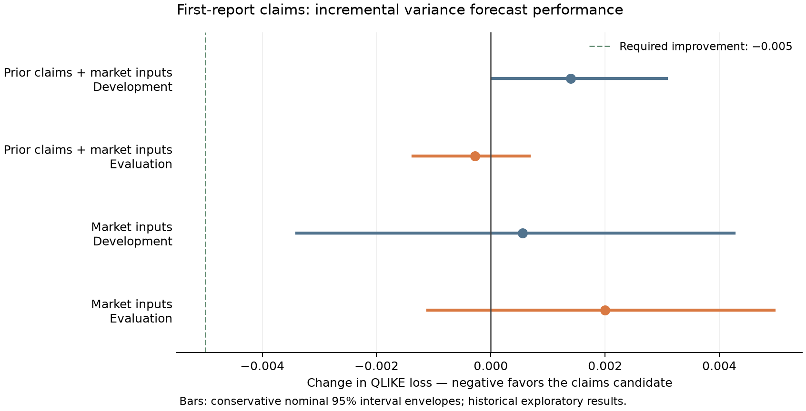

# First-report claims and five-session QQQ variance

**No new qualifying predictive signal.** Both comparisons were completed and independently verified.

Negative differences mean lower QLIKE forecast loss. The candidate adds the latest first-report claims deviation to matched market, prior-claims-level and publication-timing controls.

| Control | Development loss change | Evaluation loss change | Wave Holm p | Cumulative Holm p | Verdict |
|---|---:|---:|---:|---:|---|
| Prior claims + market inputs | +0.001394 | -0.000280 | 1.00000000 | 1.00000000 | DOES_NOT_QUALIFY |
| Market inputs | +0.000555 | +0.001998 | 1.00000000 | 1.00000000 | DOES_NOT_QUALIFY |

The matched-control comparison isolates the latest release most directly. Its later-period improvement is much smaller than the required 0.005, reverses slightly in the 2023–2025 stability slice, and fails three of the five full-calendar offsets. Development loss increased. Against the market baseline, measured loss increased in both periods. These estimates provide no basis for promoting the feature.

Across development and evaluation there are 2,408 scored origins: 972 development origins covering 203 distinct reports, and 1,436 evaluation origins covering 301. Independent reconstruction checked 7,224 scored forecasts and 7,239 total application forecasts across 118 monthly schedules and 354 model fits. Unscored applications, coverage gaps and every inherited comparison remain retained.

All 2,644 repository tests passed before the prospective freeze, with code unchanged during the 391-second check. The generated serial-null calibration passed with 94% conservative interval-envelope coverage across 200 trials; independent reconstruction matched it. This synthetic result is not a coverage guarantee for financial data.

The independent statistical verifier rebuilt both phase comparisons, all declared resampling/HAC calculations, full-calendar offsets, equal-release weighting, annual and fixed-slice diagnostics, and Holm adjustment over both the new and complete families. Source checks, forecasts, tests and statistical calibration establish integrity of this experiment; they do not guarantee usefulness on future data.

The two registered hypotheses bring the cumulative comparison family to **142**. The source disposition remains 851 supported first-report values, one unresolved corrected value and four absences. Full raw-ALFRED reconciliation remains incomplete. The 2017 conflicting counts remain unavailable to every forecasting arm.

These are exploratory tests on reused historical market partitions and dated current captures of original reports. They do not establish immutable source vintages, analyst-consensus surprises, causal labor effects or executable trading profit. Market observations from 2025-11-03 onward remain protected; numerical sources stop at 2025-10-20.

Evidence: [fixed design](DESIGN.md), [prospective freeze](freeze_record.json), [all effects and accounting](metrics.json), [terminal artifact hashes](terminal.json), and [source admission](../LEDGER_ADMISSION.json).
