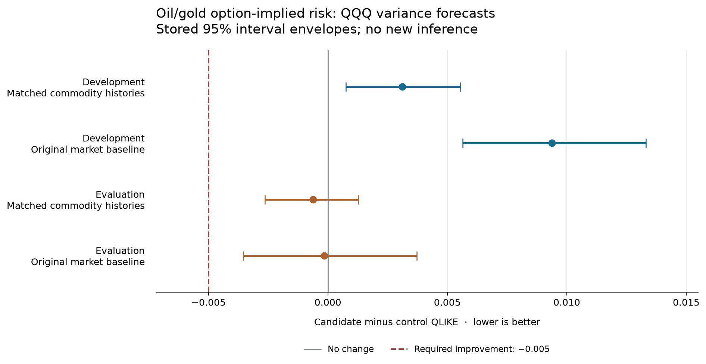

# Oil/gold option-implied risk and five-session QQQ variance

**No new qualifying predictive signal.** Both comparisons were completed and independently verified.

The joint candidate adds delayed OVX/GVZ to the market baseline and matched oil/gold return-risk histories. Negative differences mean lower QLIKE forecast loss.

| Control | Phase | Scored origins | Loss difference | 95% interval envelope | Wave Holm p | Cumulative Holm p |
| --- | --- | ---: | ---: | --- | ---: | ---: |
| Matched commodity histories | Development | 998 | +0.003111 | [+0.000749, +0.005557] | 1.00000000 | 1.00000000 |
| Matched commodity histories | Evaluation | 1,452 | -0.000616 | [-0.002638, +0.001276] | 1.00000000 | 1.00000000 |
| Original market baseline | Development | 998 | +0.009375 | [+0.005645, +0.013306] | 1.00000000 | 1.00000000 |
| Original market baseline | Evaluation | 1,452 | -0.000153 | [-0.003538, +0.003716] | 1.00000000 | 1.00000000 |

The required improvement is at least 0.005 in both phases against both controls, together with the fixed uncertainty, offset and stability gates. The figure uses the stored interval envelopes without new resampling.

Independent reconstruction checked 7,350 scored forecasts across 2,450 origins and 7,380 total application forecasts across 2,460 origins. It verified 118 monthly fits and 354 individual model fits, retaining 2,464 requested coverage origins on the 6,696-row reference calendar.

A completed nonqualifying result does not establish equivalence or rule out every possible commodity signal. No feature is promoted by this result.

All 2,800 repository tests passed before the prospective freeze. Generated serial-null calibration achieved 91.5% conservative interval-envelope coverage across 200 replications and was independently checked. This generated calibration is not a coverage guarantee for financial data.

The two registered comparisons preserve all 142 inherited entries, for **144 total**. OVX/GVZ describe 30-calendar-day USO/GLD option-implied risk; this differs from the five-session QQQ variance proxy. Current captures do not prove immutable historical vintages or exact file-publication clocks. The one-session lag does not repair later revisions.

The inherited vendor ETF price series was intended to use adjusted close when available, with a raw-close fallback. Its exact captured field and historical vintage are not independently established; no split-adjustment proof or data repair is asserted. Cboe quotation-source and strike-selection changes remain part of the fixed history.

Historical development/evaluation periods have been reused. No outcome here establishes untouched confirmation, a measured variance risk premium, execution profit or universal orthogonality. Numerical sources stop at 2025-10-20; market outcomes from 2025-11-03 onward remain protected.

Evidence: [final metrics](metrics.json), [terminal hashes](terminal.json), [prospective freeze](freeze_record.json), [full checks](FULL_PRECHECK.json), [generated calibration](calibration.json), and [PDF figure](comparison_intervals.pdf).
Independent evidence: [forecast and score verification](verification.json).
