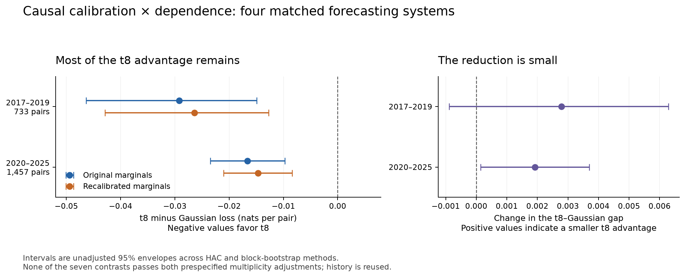

# Most of the t8 advantage survives this correction; calibration quality remains mixed

The four-cell experiment completed with independent verification on **2,190 return pairs**.
The t8 model retained lower average joint loss than Gaussian dependence after
recalibration. The measured advantage shrank by about **9.6% in development and
11.6% in evaluation**. These percentages describe changes in the paired advantage,
not percentage changes in continuous log loss or shares attributable to a mechanism.

**None of the seven comparisons cleared the prespecified adjusted-difference
threshold.** This calibration did not consistently improve the individual
forecasts, so the experiment cannot establish that the dependence advantage
survived a successful repair of the marginals. The mechanism remains unresolved.

## Four matched forecasts

Both marginal systems use the original issued base forecasts. The correction
adjusts location and scale of their Gaussianized probability scores, using only
mature past issued errors. Both dependence families are refitted on that same
archive within each marginal system. Full density scores include the calibration
Jacobian. Every comparison uses identical dates.

Negative t8-minus-Gaussian loss differences favor t8. Units are nats per return pair.

| Marginal system | Development: Feb 2017–2019 | Evaluation: 2020–Oct 2025 |
| --- | ---: | ---: |
| Original issued marginals | -0.029213 | -0.016616 |
| Recalibrated marginals | -0.026422 | -0.014692 |

Intervals in the figure are unadjusted 95% envelopes across HAC126 and the three
block-bootstrap methods. They are not simultaneous or multiplicity-adjusted
confidence intervals. The strict adjusted gate can fail even when an individual
unadjusted interval excludes zero.

## The change in the gap

The interaction is calibrated gap minus original gap; positive means the t8
advantage became smaller. Development gives **+0.002790**, with interval envelope
**[-0.000889, +0.006286]**. Evaluation gives **+0.001923**, with envelope
**[+0.000147, +0.003700]**. The conservative two-phase probability is **0.123103**;
Holm7 is **0.615513**, and cumulative Holm158 is **1.0**. This does not establish
an adjusted attenuation effect.

A larger descriptive change occurred before recalibration: on the same later
1,457 dates, the original study's t8 advantage was 0.031017, while refitting both
copulas on historical issued errors gives 0.016616. The earlier study instead fit
copulas on current-model in-sample residuals. This procedural sensitivity deserves
attention, but the matched old-study bridge is descriptive, not an eighth
registered test or a causal estimate. It does not invalidate the original
specified-system result.

## Did the individual forecasts improve?

Calibration minus original marginal loss is positive when calibration worsened
average performance. Both assets worsened in development. In evaluation, QQQ
improved slightly and SPX worsened slightly; neither provided an adjusted gain.

| Individual forecast | Development loss change | Evaluation loss change |
| --- | ---: | ---: |
| QQQ | +0.003933 | -0.001304 |
| SPX | +0.006281 | +0.001065 |

The later-period tail coverage also remains uneven. The intended frequency is
2.5% in each tail:

| Asset / tail | Original frequency | Recalibrated frequency |
| --- | ---: | ---: |
| QQQ / Lower | 3.84% | 3.57% |
| QQQ / Upper | 1.65% | 1.30% |
| SPX / Lower | 3.29% | 3.43% |
| SPX / Upper | 0.82% | 1.17% |

QQQ normal-score variance moved from 1.0966 to 1.0210, toward the reference one.
SPX moved from 0.9981 to 1.0408, away from it. Negative skewness remained about
-0.34 for QQQ and -0.44 for SPX. These are descriptive diagnostics, not additional
significance tests. Adjusting location and scale does not generally correct
skewness or time-varying model errors.

## All registered comparisons

Loss changes are candidate minus control except the explicitly defined interaction.
Probabilities below are the conservative maximum over both periods and all methods,
then adjusted across seven new and 158 cumulative tracked comparisons.

| Contrast | Development mean | Evaluation mean | Conservative p | Holm7 | Holm158 |
| --- | ---: | ---: | ---: | ---: | ---: |
| original_gap | -0.029213 | -0.016616 | 0.0010725 | 0.0075075 | 0.156585 |
| calibrated_gap | -0.026422 | -0.014692 | 0.0016275 | 0.009765 | 0.23436 |
| interaction | +0.002790 | +0.001923 | 0.123103 | 0.615513 | 1 |
| gaussian_calibration | +0.005358 | -0.003825 | 0.449925 | 1 | 1 |
| t8_calibration | +0.008148 | -0.001901 | 0.646934 | 1 | 1 |
| qqq_calibration | +0.003933 | -0.001304 | 0.521116 | 1 | 1 |
| spx_calibration | +0.006281 | +0.001065 | 0.429322 | 1 | 1 |

The wave threshold is 0.05/(28×29) = 0.0000615764; the cumulative threshold is
0.05. Detection also requires the same strict sign in both periods. These 158
comparisons are the tracked family, not a complete repository-lifetime census.
No new signal was promoted by this mechanism diagnostic.

## Descriptive marginal/copula score components

These are algebraic components of the same complete forecasts:
`joint loss = summed marginal loss + copula loss`. Their levels can be negative.
This table does not implement Fissler–Hoga's lexicographic attribution test.

| Period | Cell | Summed marginal loss | Copula loss | Full joint loss |
| --- | --- | ---: | ---: | ---: |
| development | orig_gaussian | -7.273887 | -0.659147 | -7.933034 |
| development | orig_t8 | -7.273887 | -0.688360 | -7.962247 |
| development | cal_gaussian | -7.263672 | -0.664004 | -7.927677 |
| development | cal_t8 | -7.263672 | -0.690426 | -7.954099 |
| evaluation | orig_gaussian | -6.528472 | -0.752621 | -7.281094 |
| evaluation | orig_t8 | -6.528472 | -0.769237 | -7.297709 |
| evaluation | cal_gaussian | -6.528712 | -0.756207 | -7.284919 |
| evaluation | cal_t8 | -6.528712 | -0.770899 | -7.299611 |

## Literature and the next discriminating test

[Fissler and Hoga](https://arxiv.org/pdf/2410.04165) require correct common
marginals for true-copula optimality in their restricted class. Our result remains
a comparison of complete forecasts under imperfect marginals. Their sequential
attribution procedure is distinct from our seven adjusted scalar comparisons.
The detailed [primary-source review](../LITERATURE_REVIEW.md) also distinguishes
Chen–Fan's two 2006 papers and the assumptions behind rank estimation.

Four generated rank checks confirmed fixed monotone-transform invariance, with a
time-varying-scale negative control. No historical rank pseudo-score was added.
A forecasting extension based on ranks needs either continuous training-only
marginal densities with declared tails, or a separately scored categorical
forecast; ranking the full future sample would not be an issued forecast.

The next useful marginal correction should be able to address skewness and should
first demonstrate held-out marginal improvement. A separately specified asymmetric
copula arm is also motivated by the literature, but an individual tail imbalance
alone does not identify asymmetric dependence. This run provides no new standalone
volatility, trading-profit or untouched-confirmation result.

## Execution and retained evidence

- 143 selected prewritten/generated and dependency checks passed, with no skips,
  failures or errors; new code also passed lint.
- The first freeze preparation encountered a report-relative manifest path format
  that the reader interpreted at repository root. The repair and regression test
  occurred before registration or new numerical access. Original receipts and the
  failed preparation are retained in `../prefit/attempt_1/`.
- The executable freeze was recorded at 16:26:15 UTC on 2026-09-09. The verified
  run completed at 16:27:09. These local records do not provide external time
  attestation.
- The fixed warm-up excluded 272 original issuance dates. Issuance began
  2017-02-01; 733 development and 1,457 evaluation pairs were scored. One further
  issued origin was unscored at an original phase boundary. Warm-up and other
  masked positions remain in the original inference calendars.
- 105 monthly fits used 271–2,449 mature archive pairs. Independent reconstruction
  checked all 420 dependence fits/certificates and 420 calibration parameters.
  There are 2,191 application records representing 8,764 joint distributions,
  of which 8,760 were scored across the four cells.
- Exact saved bytes were reloaded for verification. Terminal hashes bind outputs,
  proof reports and metrics. The freeze pins 30,179 paths; a private 8.45 MB
  snapshot preserves 671 code, protocol, evidence and immediate-input files.
  It is a snapshot for this diagnostic, not a copy of every ancestral raw dataset.
- Original frozen study files and the unrelated dirty worktree files were
  preserved. No commit, push, external data acquisition or simulation rerun was
  performed.

See [metrics](metrics.json), [forecast verification](forecast_verification.json),
[score verification](score_verification.json), [terminal record](terminal.json),
[protocol](../../../copula_calibration.yaml), [pre-run test receipt](../PREFIT.json)
and [standalone PDF figure](calibration_comparison.pdf).

The separate [saved-artifact audit](INDEPENDENT_REVIEW.json) found no discrepancies
in the frozen inputs, outputs, registration, test receipt or figure values. It
also independently reproduced the descriptive old-study bridge from saved
forecasts, without refitting models or adding inference. All historical windows
have been reused; current-vintage inputs do not establish point-in-time vendor
vintages or untouched confirmation. The [publication receipt](PUBLICATION.json)
binds this post-result narrative and figure to the completed diagnostic.
