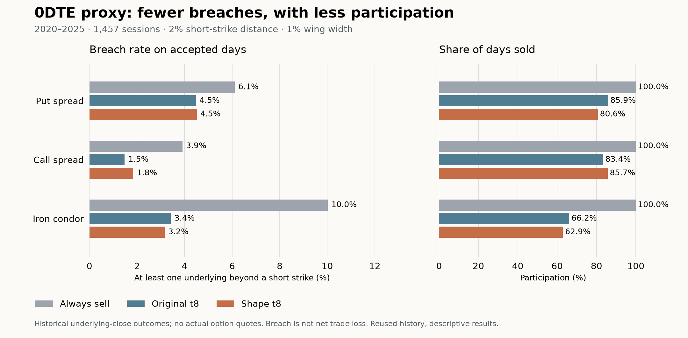

# Same-day spread safety: completed descriptive replay

Prepared 2026-09-13. Status: **COMPLETED_VERIFIED_DESCRIPTIVE_PROBABILITY_REPLAY**.

At the primary 2% strike distance, the fixed probability filters selected sessions with fewer expiration strike breaches and lower average expiration liabilities than selling every day. **The new shape calibration did not consistently improve on the older filters.** This is evidence worth carrying into a prospective options benchmark, with no new model promoted and no claim of executable option profit.

The shape correction improved descriptive marginal density scores, but the registered wave29 attempt failed a numerical tail-quantile check. Its **UNEVALUABLE verdict and six comparisons recorded as p=1 remain unchanged**. The separately registered replay uses the already saved breach probabilities and the unchanged trading rules. It does not recover statistical significance from the failed attempt.

## What was tested

- QQQ and SPX, equally allocated, using their saved next-session open-to-close log returns. These are two underlying instruments; SPX is not SPY. Features retain the inherited extra lag, ending on the reference session preceding the forecast origin.
- Hypothetical same-day put credit spreads, call credit spreads and iron condors. Primary short strikes are **2% from the session open**, with **1% of open as wing width**. Fixed 1% and 3% strike distances are reported as sensitivities, without selecting a winner.
- Each model sells both asset spreads only if its forecast probability that **at least one underlying breaches a short strike at expiration is at most 10%**. Six models and an always-sell control are retained.
- Aggregate gross-width reserve is **2% of current equity**, split 1% per asset. Position size does not increase with assumed premium. Each structure/distance/credit case is a separate account.
- Development has **733 sessions, target dates 2017-02-02 through 2019-12-31** after warmup. Evaluation has **1,457 sessions, target dates 2020-01-03 through 2025-10-20**. The history was previously inspected and uses current-vintage source data; neither phase is a new untouched prospective test.

The payoff is terminal intrinsic liability at the observed underlying close. Actual contract availability, entry quotes, fills, settlement conventions and intraday exits were not reconstructed. Daily 0DTE availability also varied historically; these hypothetical cases do not assert that every tested contract existed. [Cboe's history of same-day trading](https://www.cboe.com/insights/posts/the-evolution-of-same-day-options-trading).

## Main result: fewer breaches, with less participation

Evaluation, primary 2% distance. Breach means at least one underlying finishes beyond a short strike. **It is not the net losing-trade rate, an intraday touch, or a full-width loss.** Each filtered rate uses that policy's own accepted days.

| Structure | Shape t8 sold days | Always-sell breach | Original t8 breach | Shape t8 breach | Shape t8 participation |
| --- | --- | --- | --- | --- | --- |
| Put | 1,175 / 1,457 | 6.11% | 4.47% | 4.51% | 80.6% |
| Call | 1,248 / 1,457 | 3.91% | 1.48% | 1.84% | 85.7% |
| Condor | 917 / 1,457 | 10.02% | 3.42% | 3.16% | 62.9% |

Every cell below is **participation / accepted-day breach rate / mean expiration liability**, all in percent. Liability is a percentage of wing width, averaged equally across the two assets. Different accepted-day sets mean this is a policy comparison, not a controlled attribution of forecast improvement.

| Policy | Put | Call | Iron condor |
| --- | --- | --- | --- |
| Always sell | 100.00 / 6.11 / 2.587 | 100.00 / 3.91 / 1.609 | 100.00 / 10.02 / 4.196 |
| Original Gaussian | 85.38 / 4.42 / 1.731 | 82.91 / 1.32 / 0.386 | 65.55 / 3.46 / 1.218 |
| Original t8 | 85.93 / 4.47 / 1.728 | 83.39 / 1.48 / 0.473 | 66.16 / 3.42 / 1.207 |
| Affine Gaussian | 84.21 / 4.48 / 1.755 | 81.81 / 1.34 / 0.391 | 63.42 / 3.25 / 1.019 |
| Affine t8 | 84.56 / 4.46 / 1.748 | 82.29 / 1.42 / 0.473 | 63.69 / 3.34 / 1.123 |
| Shape Gaussian | 79.89 / 4.55 / 1.787 | 85.24 / 1.85 / 0.655 | 62.66 / 3.18 / 1.025 |
| Shape t8 | 80.65 / 4.51 / 1.770 | 85.66 / 1.84 / 0.652 | 62.94 / 3.16 / 1.021 |

- **Puts:** shape calibration rejects more days, while accepted-day breach rates and liabilities are slightly worse than the older filters.
- **Calls:** shape calibration accepts more days, with higher breach rates and liabilities than the older filters.
- **Iron condors:** shape calibration lowers average liability substantially versus always selling. Comparable protection already appears with affine Gaussian: 1.019% of width versus 1.021% for shape t8, at 63.42% versus 62.94% participation.

The copula contributes only to joint risks in this setup. Within a fixed marginal system, each asset's individual breach probability and the portfolio's mean liability are identical for Gaussian and t8 dependence. Across all 19,710 session/structure/distance cases, Gaussian versus t8 changes the sell decision in only **76 original, 52 affine and 60 shape cases**. A better joint density score alone does not establish a useful spread-selling edge.

Full-width losses remain. The following are **counts of any asset / both assets reaching full-width liability** among accepted days, not probabilities inferred from a large sample:

| Structure | Always sell | Original t8 | Shape t8 |
| --- | --- | --- | --- |
| Put | 29 / 9 | 16 / 5 | 15 / 5 |
| Call | 17 / 8 | 4 / 2 | 5 / 2 |
| Condor | 46 / 17 | 9 / 4 | 7 / 2 |

All six evaluation put filters retain five simultaneous full-width losses. In development, every model filter retains the same simultaneous full-width counts: three puts, one call and three condors. These scarce events cannot certify safety.

## Sensitivities and development

The 1% and 3% distance results are retained for all models in [ALL_CASES.md](ALL_CASES.md). The headline is not uniform across distances. At 1%, the shape-t8 condor filter accepts only **32 of 1,457 evaluation sessions** and records **6 breaches (18.75%)**, despite a forecast gate of at most 10%. Original t8 accepts 49 sessions and records 6 breaches (12.24%). The samples are small; these are concerning descriptive rates, not a new hypothesis test. At 3%, shape t8 accepts about 91% of condor sessions, with a 1.82% accepted-day breach rate, close to original t8's 1.80% at about 92% participation.

Development at the primary distance, using the same units as above:

| Policy | Put | Call | Iron condor |
| --- | --- | --- | --- |
| Always sell | 100.00 / 2.46 / 1.252 | 100.00 / 1.77 / 0.646 | 100.00 / 4.23 / 1.898 |
| Original Gaussian | 95.63 / 1.71 / 0.991 | 93.86 / 1.45 / 0.403 | 87.86 / 2.17 / 0.860 |
| Original t8 | 95.63 / 1.71 / 0.991 | 94.00 / 1.45 / 0.403 | 87.86 / 2.17 / 0.860 |
| Affine Gaussian | 94.95 / 1.72 / 0.998 | 93.18 / 1.32 / 0.400 | 86.63 / 2.20 / 0.872 |
| Affine t8 | 95.09 / 1.72 / 0.996 | 93.32 / 1.46 / 0.406 | 86.77 / 2.20 / 0.870 |
| Shape Gaussian | 93.86 / 1.60 / 0.996 | 94.00 / 1.45 / 0.403 | 85.13 / 2.08 / 0.860 |
| Shape t8 | 93.86 / 1.60 / 0.996 | 94.00 / 1.45 / 0.403 | 85.27 / 2.08 / 0.858 |

## Premiums, sizing and avoided losses

The account engine uses three fixed credits: **5%, 10% and 20% of wing width**, with assumed round-trip costs of **2% of width**. For a condor, credit is the combined credit for both wings. These credits and costs are scenarios, not observed prices. On a sold day, equity return is `0.02 × (credit − cost − portfolio liability)`; otherwise it is zero. Phase accounts reset to one.

A low breach probability is only part of the spread-selling decision. The available premium must compensate for expected liability, execution costs and the risk being borne. Quiet days at distant strikes may offer very little premium. Applying the same credit to every historical day can create large compounded returns with no evidence that those trades were available.

For scale, historical average liability plus the assumed cost gives the following **average-cost credit thresholds**. These are percentages of wing width, not percentages of underlying price or equity. They are retrospective arithmetic, not live minimum-credit recommendations or compensation for model uncertainty and tail risk.

| Structure | Always sell | Original t8 accepted days | Shape t8 accepted days |
| --- | --- | --- | --- |
| Put | 4.587% | 3.728% | 3.770% |
| Call | 3.609% | 2.473% | 2.652% |
| Condor | 6.196% | 3.207% | 3.021% |

Under the **10%-of-width credit scenario only**, evaluation maximum account drawdown changes from 9.52% to 3.18% for puts, 12.13% to 2.18% for calls, and 23.98% to 1.84% for condors when comparing always selling with shape t8. These are expiration-only hypothetical account drawdowns. Actual intraday drawdowns, margin calls, assignment and executable exits are outside the data.

Foregone premium matters. At the 5%-credit assumption, shape t8 has higher terminal wealth than always selling for all three primary structures; at 20%, it has lower terminal wealth for all three. At 10%, only the condor improves terminal wealth versus always selling. This change in ranking is a reason to collect actual quotes, not choose a favorable assumed premium. All **378 phase/case/policy/credit rows** and their compounded returns, drawdowns and attribution are retained in [ALL_CASES.md](ALL_CASES.md).

The saved path decomposes each day's return difference from always selling into avoided liability, missed credit and saved fees. This identity applies to daily equity fractions; their sums are **not** a decomposition of the difference between two compounded terminal wealth paths.

## What the new calibration changed

After the frozen affine correction, a bounded-parameter sinh-arcsinh transformation adjusts shape using only matured historical forecast errors at each monthly refit. Scores use full normalized densities, including the recalibration Jacobian. The Gaussian and t8 dependence arms are crossed with original, affine and shape marginals; single-asset effects are therefore distinguishable from dependence effects in the design. The transformation is motivated by [Jones and Pewsey, Sinh-arcsinh distributions](https://doi.org/10.1093/biomet/asp053); this implementation fixes the affine parameters separately rather than fitting all four parameters jointly.

Descriptive shape-minus-affine mean negative log-density differences (lower is better):

| Phase | QQQ | SPX |
| --- | --- | --- |
| Development | -0.006225 | -0.008035 |
| Evaluation | -0.002275 | -0.001874 |

Evaluation lower/upper probability-transform tail rates for shape marginals are **2.81% / 1.65% for QQQ** and **2.88% / 2.20% for SPX**, against nominal 2.5% in each tail. They are generally closer than affine calibration, but positive normal-score mean bias increases and negative skew remains. At the primary 2% distance, all-session breach Brier scores improve slightly for puts/calls and worsen for condors in both phases, compared with affine calibration. There is no consistent improvement across every calibration or payoff metric.

These are descriptions of independently verified saved density rows. No p-values have been reconstructed and no attribution mechanism has been established. The old simulation remains an assumed-model benchmark, not a ceiling on possible score gains.

## Verification and the failed original attempt

The original shape study passed **173 selected pre-run tests**, including the forecast transformations, spread accounting and prospective ledger. Independent forecast reconstruction checked 105 monthly fits, 2,191 issued applications, 210 marginal shape fits and 210 new dependence fits, normalized density factors, maturity clocks and optimization certificates. The density score verification completed before the later numerical failure.

The spread sampler then exceeded its fixed numerical consistency limit for a sampled tail quantile: **0.03620 difference versus a 0.03 limit**. Some rare liabilities were also missed by finite sampling, yielding 429 sampled tail averages below the separately integrated mean. The original study remains UNEVALUABLE with all six planned comparisons recorded as p=1. No frozen result, threshold or forecast was changed to obtain a pass.

The separate replay passed **31 additional pre-run checks**. It authenticates and reuses the exact saved probabilities, strikes, dates and decisions, with no refit, resampling, new threshold, inference or promotion. The largest two-scramble breach-probability difference was 0.00354, below the original 0.005 diagnostic limit. All 69 model/case/date rows straddling the 10% threshold between scrambles retain the originally specified average-probability decision. Agreement between two scrambles is not a rigorous error bound.

The replay excludes sampled VaR and expected-shortfall estimates. Its adapter uses the known maximum terminal debit of one wing width to satisfy an unused legacy accounting field; that field is removed from published tables. Decisions and cash flows never depend on that field. The independent accounting verifier reconstructed all saved account outputs and reported VERIFIED.

The resulting tables contain 137,970 positions, 413,910 path rows, 19,710 shared realized outcomes, 378 scenario summaries and 324 probability/calibration summaries. Hash receipts bind them to the failed original attempt and the separately frozen replay protocol. See [terminal.json](terminal.json), [accounting_verification.json](accounting_verification.json), and [the preserved original terminal](../copula_shape/predictive/terminal.json).

## New-data system and next benchmark

The implemented, tested ledger preserves raw source bytes, model versions, immutable issued forecasts, revisions, exact receipt times and missing/late forecasts. Its current scorer supports scalar normal/Student-t densities and variance forecasts. The option decision adapter, calibrated joint-density scorer and live feed integration remain to be built; **collection is not running**.

The next benchmark should retain one frozen candidate and its control, exact option contracts and synchronized bid/ask quotes at the decision, selected legs and size, actual settlement and all fees. Retain rejected trades as well as accepted ones. A stop or early-exit rule needs intraday option quotes. Bind each forecast and decision to data received before its actual target starts.

Start with a fixed collection and evaluation plan, not a rule to stop when a result looks favorable. Five hundred new sessions can assess broad calibration but contain only 12.5 expected observations in a nominal 2.5% tail; a rare-loss safety claim requires more evidence and a planned precision/power analysis.

The complete operating plan, supported interfaces, provider documentation and remaining integration work are in [PROSPECTIVE_BENCHMARK.md](../../docs/PROSPECTIVE_BENCHMARK.md). No market data beyond 2025-10-20 was opened, and no subscription, live order or scheduled collector was created for this study.
