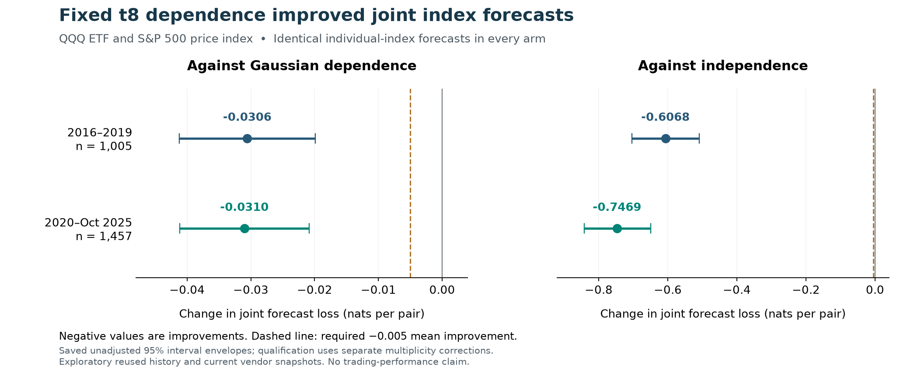

# A qualifying historical improvement in joint index-risk forecasting

The fixed Student-t8 dependence model improved the **joint next-session return
forecast for QQQ and the S&P 500** against both separately fitted Gaussian
dependence and independence. Both comparisons passed every preregistered effect,
support, stability and adjusted-probability gate. The completed wave27 study
records an **exploratory joint-density lead**.

| Comparison | Change in loss, 2016–2019 | Change in loss, 2020–Oct 2025 | Result |
| --- | ---: | ---: | --- |
| Against Gaussian dependence | −0.030569 | −0.031017 | All gates passed |
| Against independence | −0.606797 | −0.746935 | All gates passed |

Loss is negative joint log density, measured in nats per observed return pair.
Negative differences are improvements. The stronger Gaussian comparison is the
main incremental finding: its improvement exceeded the fixed 0.005 threshold in
both periods and remained negative in both later stability slices and every
calendar-offset group. Beating independence alone would not have qualified.

Both cumulative adjusted p-values are **0.0003775**, accounting for the **151
tracked comparisons**. Both wave-adjusted values are 0.000005, below the fixed
wave budget of 0.0000661376. The conservative unadjusted value of 0.0000025 is the
minimum resolvable value with the prescribed 399,999 bootstrap draws; it should
not be interpreted as more precise evidence about the underlying tail
probability. This tracked family is not a complete repository-lifetime census.

## What appears useful

The improvement comes from modeling how the two return distributions fit
together. All three arms use **identical forecasts for each individual index**:
the same conditional mean, variance and fixed t8 marginal distribution. The
dependence model adds a better joint distribution under those shared assumptions.
It is a candidate component for subsequent combined-risk forecasting research.

There is no demonstrated improvement to either index's standalone volatility or
expected return in this experiment. It introduces no external predictive input,
and shared marginal misspecification can still create an apparent dependence
advantage. Neither portfolio risk-limit calibration nor trading performance was
tested. A model for a joint distribution can be useful without establishing any
of those further claims.

The construction uses established copula mathematics, described by
[Embrechts, Lindskog and McNeil](https://people.math.ethz.ch/~embrecht/ftp/copchapter.pdf).
The experiment tests its incremental value in this repository's specified
forecasting task; it makes no claim of a new statistical method.

## Evidence and limits

The paired evaluation covers **2,462 forecast origins**: 1,005 in development and
1,457 in evaluation. There were 118 monthly fits, 472 marginal-model
reconstructions, and 236 independently checked dependence fits. Verification
covered all 7,389 issued forecasts, including three unscored forecasts, and all
7,386 scored forecasts. The full SPX reference calendar and missing/end positions
were retained for inference. The model inputs use the session before each
origin, and predict the following session's raw intraday return pair.

All **3,400 selected repository tests passed before the executable freeze**,
including 87 new generated checks. Six previously disclosed historical-replay
tests remained quarantined. The independent forecast verifier reconstructed the
actual saved outputs and every global dependence-fit certificate. A separate
score verifier reconstructed the densities, both comparisons, 12 bootstrap runs
and four HAC endpoints. No failed comparison was dropped or reweighted.

Development and evaluation history have been reused. Earlier regression tests
accessed the period beginning 2025-11-03, so that period is not untouched
confirmation. This run's numerical inputs end 2025-10-20. The current vendor
snapshots do not certify complete historical price or implied-volatility
vintages, synchronized auctions, or exact publication latency. QQQ is an ETF;
SPX is a price index. The global fit certificates are numerical rather than
exact-arithmetic proofs. The reused synthetic interval calibration is a
diagnostic, not a guarantee of market coverage or adjusted-tail accuracy.

The research search has found a candidate that meets its fixed historical
qualification rules. The next validation stage is a locked forecast on
subsequently untouched outcomes, followed by a separately specified test of
portfolio-risk usefulness. Further tuning on these inspected periods would not
provide that confirmation.

See the [complete numerical summary](SUMMARY.md), [frozen protocol](../../../joint_copula.yaml),
[metrics](metrics.json), [runtime verification](verification.json),
[terminal record](terminal.json), and [selected-test receipt](TEST_GATE_RESULT.json).
The chart uses saved, unadjusted diagnostic interval envelopes; no model or
inference was rerun to create this report.
