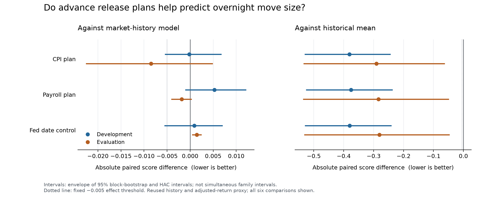

# Advance announcement plans: verified result

**No new predictive signal qualified.** CPI, payroll and original Fed meeting
plans did not establish an incremental improvement in forecasts of QQQ overnight
move size over the market-history model. All six registered comparisons remain
in the cumulative family of 84 enumerated contrasts.

The run produced **10,495 forecasts on 2,099 common dates**, using 101 monthly
fits and five models. Development contains 983 dates in 2016–2019; evaluation
contains 1,116 dates in 2020–October 2025. The initial fit has 1,122 completed
training labels. No setting or gate changed after fitting began.

## What the models learned

Negative differences below mean a better score than the market-history control.
These are absolute differences in `log(h) + q/h`, not percentages. The fixed
effect requirement was a difference at or below −0.005 in both periods, plus
stability, measurement sensitivity and corrected statistical checks.

| Added information | Development | Evaluation | Interpretation |
|---|---:|---:|---|
| CPI original plan | −0.000189 | −0.008488 | Earlier improvement negligible; uncertainty includes no increment |
| Payroll original plan | +0.005283 | −0.001809 | Worse earlier; later improvement below the effect threshold |
| Fed original final date | +0.000924 | +0.001460 | Worse in both periods |

CPI's evaluation uncertainty envelope is [−0.022630, +0.004941]. Its development
gap also becomes slightly positive in the fixed adjustment-event sensitivity.
It is not a passing lead. The payroll and Fed results provide no qualifying
alternative. Both evaluation subperiods and every annual diagnostic remain in
the machine-readable results; none was selected to rescue a candidate.

All three augmented models beat the same-sample historical mean in average
score. They did not survive the full corrected comparisons against that control,
and their much smaller differences against the market-history model show why
the mean comparison alone cannot establish new calendar information. The
strong control already contains realized overnight/daytime history, range
variance, VXN/VIX, weekday and nominal elapsed time.

## Methodology and coverage

The source audit admitted 168 CPI plans, 176 payroll plans and 128 original Fed
meeting dates from 16 annual announcements. It excluded explicit reissues in
17 CPI and 13 payroll documents, plus four CPI clauses lacking a stated year.
The original payroll ledger omitted the reissue screen. Independent review
caught this before any fit; its original bytes and intermediate corrections
remain preserved, with a separate final admission ledger. No missing plan was
turned into a non-event.

The exclusions materially reduce coverage: **only 42 dates remain in 2020**.
This result cannot establish performance through the full pandemic episode.
The surviving yearly counts are 252, 251, 251, 229, 42, 208, 231, 250, 207 and
178 for 2016 through the 2025 cutoff. Every model uses the same dates.

The target is a squared vendor-adjusted overnight log-return proxy, rather than
integrated variance or executable cash profit. Original plans are retained
after cancellations; sources must predate the previous observed session.
The predictor uses a declared weekday civil-time window that ignores exchange
holidays and early closes. Source extracts are current documentary evidence,
not immutable historical website vintages. Historical reuse, nonrandom source
gaps and these measurement limitations remain even after multiplicity correction.

The implementation also fixes a publication-failure edge case: a caught failure
replaces promotable metrics with all six unevaluable p-values of one, retaining
any computed scores separately as unpublished diagnostics. Two fault-injection
tests failed before this correction and passed before the empirical run.

## Verification and retained evidence

**765 repository tests passed before the run**, followed by the runner's 75
focused checks. New scoped lint checks passed. The independent verifier then
reconstructed all 20 inputs across 6,696 dates, every source join, every monthly
fit and forecast, 12 phase comparisons, 36 bootstrap runs with 49,999 draws each,
12 adjustment sensitivities, both multiplicity corrections and all 90 ledger
events. It used a separate BFGS optimizer and unchanged numerical tolerances.
Verification passed on its first empirical run.

The manifest pins 18 code/test dependencies, 805 input artifacts and 188 earlier
protocol/report artifacts; all hashes remained unchanged. The preceding three
waves' separate hash checks also passed. The four recent waves now account for
30 added contrasts and 70,548 forecasts. The cumulative 84 includes the earlier
54 enumerated model comparisons; it is not the entire repository's lifetime
experiment count. Protected November 2025 onward observations were not used.

- [Design](DESIGN.md) and [frozen protocol](../../macro_overnight.yaml)
- [All results](results.md), [complete metrics](metrics.json) and [verification](verification.json)
- [Pre-run tests](full_pre_run_tests.txt), [runner checks](pre_run_checks.txt) and [trial ledger](trial_ledger.jsonl)
- [Independent source verification](SOURCE_INDEPENDENT_VERIFICATION.md), [payroll admission correction](NFP_SOURCE_AUDIT.md) and [CPI audit](CPI_SOURCE_AUDIT.md)
- [Exportable figure](comparison_intervals.pdf)

The next distinct proposed mechanism is whether reported measurement uncertainty
changes the persistence of a recent realized-volatility move. The
[prospective design](NEXT_MEASUREMENT_DESIGN.md) uses the already audited Risk Lab
SPY measurements, with a width-only control and fixed alternative-measurement
checks. It has not been registered or fitted. Its timing and source-vintage
assumptions must remain explicit; no macro result changed an earlier trial.
