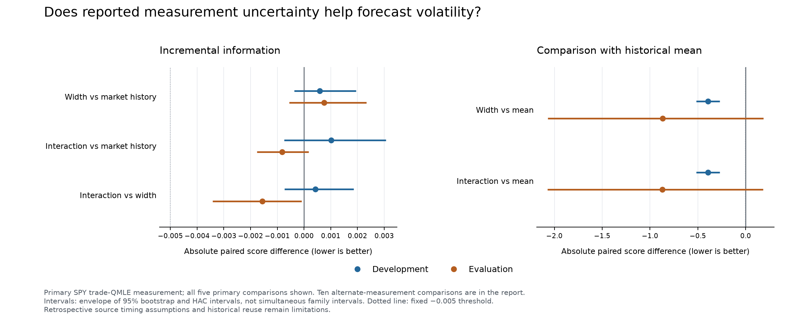

# Reported uncertainty and volatility persistence: verified result

**Neither candidate qualified.** The provider's reported uncertainty width did
not improve on the market-history model. Letting that width change the modeled
persistence of a volatility innovation produced a tiny evaluation improvement
and a deterioration in development. Both alternative volatility measurements
gave the same pattern.

The experiment generated **8,008 forecasts on 2,002 common origins**, with 112
monthly fits and four models. The first fit used 1,252 completed training labels.
Development contains 942 scored dates from January 4, 2016 through December 26,
2019. Evaluation contains 1,060 dates from January 2, 2020 through October 15,
2025. Their final target-maturity dates are December 31, 2019 and October 20,
2025. The two-session publication-delay assumption was retained throughout.

## Increment over the strong controls

These are absolute paired proper-score differences on the primary trade-QMLE
measurement. Negative means better. They are not percentage improvements.

| Added model / control | Development gap | Evaluation gap |
|---|---:|---:|
| Width / market history | +0.000588 | +0.000745 |
| Interaction / market history | +0.001019 | −0.000821 |
| Interaction / width | +0.000431 | −0.001566 |

The fixed primary effect threshold was −0.005 in both periods, against every
required control. None of these comparisons met it. The interaction's evaluation
gap against market history has a 95% uncertainty envelope of [−0.001766,
+0.000173]. Its gap is almost zero in the fixed 2023–2025 slice. Width alone
worsened both evaluation slices. Neither result supports further tuning of
this same specification on the inspected outcomes.

The two augmented models had much better average scores than the historical
mean, but the conservative evaluation uncertainty was wide and those comparisons
also failed the corrected statistical gates. The market-history control already
contains own volatility persistence, implied-volatility information, broad-market
negative returns and weekdays. The mean comparison does not isolate new width
information.

All fifteen comparisons remain in [results.md](results.md) and
[metrics.json](metrics.json). Models were fitted only to trade-QMLE squared.
The five- and fifteen-minute measurements evaluated the exact same forecasts.
Their ten comparisons entered the full multiplicity family and the predefined
sign checks; they were not fitted separately or selected after inspection.
Both the fifteen-way and cumulative 99-way adjusted p-values are one for every
comparison. No candidate passes the registered overall rule.

## Coverage and interpretation

The independent parser checked 7,473 bounded measurements from the pinned
7,680-row source without numerically parsing post-fence values. There are 27
missing reference dates. Strict rolling windows and label maturity reduce the
usable sample further. Scored counts by year, 2016 through the 2025 cutoff,
are 252, 251, 190, 249, 243, 156, 150, 138, 176 and 197. The missing February
5–9, 2018 stress week remains absent; it was not filled or skipped during rolling.

This is a retrospective test of squared provider-native annualized volatility.
The source's historical publication latency, revisions, exact session boundary
and annualization factor remain unresolved. A declared delay does not establish
point-in-time availability. Early VIX9D history is back-calculated archival
training data. The displayed uncertainty interval does not establish calibrated
measurement error; a successful interaction could also reflect ordinary market
state dependence. Same-provider alternate measurements would not establish
independent-source replication. No investment-use or latent-variance claim
follows from these calculations.

## Verification and preservation

**819 repository tests passed before fitting**, along with 70 focused checks.
Pre-fit source reconstruction agreed exactly on all 107,136 feature cells,
20,088 target cells, missingness, dates and source-audit fields. Four synthetic
failure tests verified that report, registration, evaluated-ledger and protocol
failures leave all fifteen hypotheses unevaluable with p-values of one.

The independent verifier passed on its first empirical run. It checked every
forecast and monthly fit using a separate BFGS optimizer, all 6,696 rows of 16
features, all target/maturity fields, 30 phase comparisons, 90 bootstrap runs
with 99,999 draws each, both corrections and all 114 ledger events. No tolerance,
feature, source, sample gate or model setting changed after registration.

The manifest pins 139 Python source/test files, 19 inputs and 211 earlier
protocol/report artifacts, plus actual package versions and numerical backend.
All remain unchanged. The cumulative enumerated family is now 99 comparisons,
including the 15 added here; it is not the repository's lifetime trial count.
The recent five waves account for 45 added comparisons and 78,556 forecasts.
The protected market-data period beginning November 2025 remains unused.

- [Frozen design](DESIGN.md) and [protocol](../../measurement_memory.yaml)
- [Independent verification](verification.json) and [source compatibility](SOURCE_COMPATIBILITY.md)
- [Full pre-run tests](full_pre_run_tests.txt), [runner checks](pre_run_checks.txt) and [trial ledger](trial_ledger.jsonl)
- [Source and design review](SOURCE_AND_DESIGN_REVIEW.md)
- [Exportable figure](primary_comparison_intervals.pdf)

The figure uses the frozen plotting code with an eight-point horizontal tick
font for spacing; both exported formats were rendered and the PNG visually
checked. This presentation setting changes no forecasts, intervals or gates.

The [next prospective question](NEXT_INDEX_DESIGN.md) concerns 21- and 63-session
SPX price returns and one nonlinear relationship between implied and trailing
realized-risk proxies. It explicitly rejects a redundant raw-gap feature when
both components already sit in the baseline. This proposal is unregistered and
unfitted; overlapping outcomes and limited independent quarters will constrain
its interpretation.
