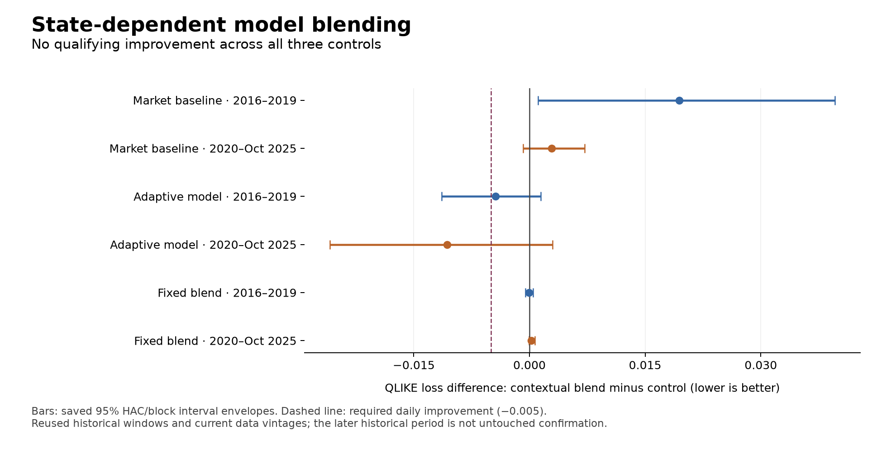

# State-dependent blending did not improve the benchmark

The completed wave26 experiment found **no qualifying predictive improvement**. Conditioning blend weights on current risk did not improve on the established twelve-input market model. This was an evaluable experiment with independent reconstruction, not a sample-support or execution failure.

| Control | QLIKE difference, 2016–2019 | QLIKE difference, 2020–Oct 2025 | Interpretation |
| --- | ---: | ---: | --- |
| Market baseline | +0.019423 | +0.002861 | Worse in both periods |
| Adaptive model | -0.004411 | -0.010679 | Lower average loss, but failed the complete qualification requirements |
| Fitted constant blend | -0.000037 | +0.000260 | Negligible early change and a later deterioration |

Negative differences are improvements. Relative to the market baseline's average QLIKE, the contextual blend's loss increased by about **10.2% in development and 1.6% in evaluation**. These are relative changes in a forecast-loss metric, not trading returns or percentages of volatility predicted correctly.

The baseline comparison deteriorated at all five calendar offsets in both periods and in both later stability slices. The fixed-blend comparison also deteriorated in both later slices. The adaptive-model comparison had lower average loss in both periods and every offset, but its early improvement missed the fixed 0.005 effect threshold and its uncertainty did not meet the probability gates. All three cumulative adjusted p-values are 1.0; wave-adjusted values are approximately 0.390, 0.390 and 0.885 against baseline, adaptive and constant respectively. Beating the weaker adaptive expert alone is insufficient when the baseline and constant blend are required controls.

The scored sample has **2,454 origins**, including 39 cold-start dates that remained in the comparison and 2,415 dates with fitted gate weights. Verification covers 9,816 scored forecasts and 10,784 total issued forecasts over 2,696 origins; 129 months of expert fitting, 258 expert fits and 232 independently certified gate fits. The record also preserves 49 expert-warmup months and 13 gate cold-start months. All 3,313 selected repository tests passed before freezing, with six explicitly disclosed historical-replay exclusions. The three new comparisons retain the 146 inherited entries for a cumulative **149**.

The model never reconstructed old forecasts using a newer expert. Its memory contains only actually issued forecast pairs and outcomes mature before each refit. Both gates used the same eligible memory; the constant control isolates the contribution from conditioning on the daily-minus-monthly risk state. The result gives no reason to tune that inspected state, memory length or penalty against the same history. It does not prove that every conditional model combination is ineffective.

## What this changes next

Further changes to the weights between these two experts have a weak justification: the gate reduced some of the adaptive model's deterioration but did not produce a better benchmark. The next proposal should change the predictive hypothesis rather than search a grid around this result. In particular, review whether a less redundant information source or a different, explicitly useful prediction target remains untested in the existing inventory before registering another model. No additional hypothesis, historical run or lead is represented by that recommendation.

## Limits and evidence

Development and evaluation history have been reused. Earlier regression tests accessed the period beginning 2025-11-03, so it cannot be called untouched confirmation; this run's numerical inputs end 2025-10-20. Current vendor snapshots do not certify complete historical data vintages. The reused synthetic interval calibration does not establish exact market coverage or adjusted-tail accuracy. No Treasury auction quantities or release clocks enter this model experiment. No trading-performance claim is made.

See the [full interval table](SUMMARY.md), [metrics](metrics.json), [independent reconstruction](verification.json), [frozen record](freeze_record.json), [selected-test receipt](TEST_GATE_RESULT.json), and [terminal record](terminal.json). The plotted intervals are saved, unadjusted diagnostic envelopes; no model or inference was rerun to create this report.
