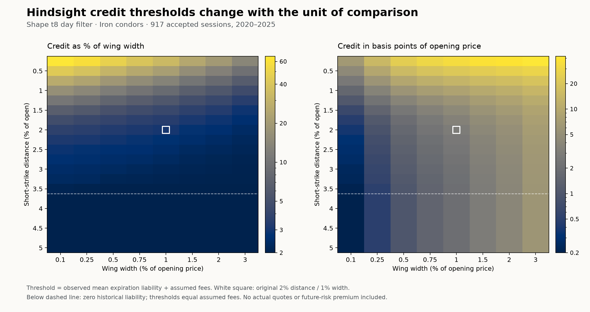

# Hindsight spread geometry: the attractive cases and the pricing trap

**Completed 2026-09-13. Explicitly selected with hindsight; no predictive promotion.**

The most striking evaluation case is the **shape-t8 day filter with iron-condor short strikes 3.75% from the open**: neither underlying breached a short strike on any of its **917 accepted sessions** in 2020–2025. Every tested wing width, **0.10% through 3.00% of opening price**, therefore had zero expiration liability. There are 48 tied geometries at distances 3.75–5.00%; the displayed 0.10% wing is just the declared tie-breaking choice.

Over the full 2017–2025 history, the first zero-liability condor distance is **4.25%**, across **1,542 shape-filtered days**. The 3.75% geometry had **two development breaches in 625 days**, so the later-period result does not hold across the entire sample. The original t8 filter also reaches zero liability at 4.25% over its 1,608 pooled accepted days.

This search found attractive hindsight **strike distances**. It did not identify a uniquely superior **wing width**. The premium convention determines the width winner, and actual quotes remain missing.

## What was searched

- **20 distances:** 0.25%–5.00% from each underlying's opening price, every 0.25%.
- **Eight wing widths:** 0.10%, 0.25%, 0.50%, 0.75%, 1.00%, 1.50%, 2.00%, 3.00% of opening price.
- Puts, calls and symmetric iron condors: **480 geometries**. QQQ and SPX are equally allocated.
- Always selling plus all six unchanged model day-selection masks from the earlier 2%-distance/1%-width test. **These masks are fixed across the new geometries. They do not forecast a 10% breach probability for the new strikes.** No model was refit, no joint probabilities were recomputed and no day was selected using its realized return.
- The inherited development 733/evaluation 1,457 sessions, plus their pooled 2,190 sessions. Origins begin 2017-02-01; target dates run 2017-02-02 through 2025-10-20. Each phase account resets to one; pooled accounting compounds all saved sessions in chronological order.
- Three constant credits of 5%, 10%, 20% of width, plus a deliberately different constant credit of **5 basis points of opening price**. Assumed round-trip costs are 2% of width throughout. A condor's credit covers both wings together.
- Each separate account reserves **2% of equity in gross maximum expiration liability**, split equally across assets. Narrower widths imply more underlying notional at the same reserve: 0.10% wings imply 20× combined notional/equity; 3% wings imply about 0.67×. This is fractional proxy sizing, with no actual contracts, integer lots, broker margin or assignment model.

The search retains 10,080 geometry summaries and 40,320 account scenarios. It selects 252 within-period/structure/policy/premium winners. All choices use the full named period in retrospect. There are no new p-values, untouched out-of-sample claims or live trading recommendations.

## First distance with zero observed expiration liability

Each entry is the nearest **tested** short-strike distance with zero liability across all eight widths, followed by the number of accepted days. A missing result means none within this finite grid. This is not an estimate of zero future risk.

| Day filter | Structure | Development | Evaluation | Pooled |
| --- | --- | --- | --- | --- |
| Always sell | Put | 4.50% (733 days) | None ≤5% (1,457 days) | None ≤5% (2,190 days) |
| Always sell | Call | None ≤5% (733 days) | None ≤5% (1,457 days) | None ≤5% (2,190 days) |
| Always sell | Condor | None ≤5% (733 days) | None ≤5% (1,457 days) | None ≤5% (2,190 days) |
| Original t8 day filter | Put | 4.50% (701 days) | 4.25% (1,252 days) | 4.50% (1,953 days) |
| Original t8 day filter | Call | 4.25% (689 days) | None ≤5% (1,215 days) | None ≤5% (1,904 days) |
| Original t8 day filter | Condor | 4.25% (644 days) | 4.25% (964 days) | 4.25% (1,608 days) |
| Shape t8 day filter | Put | 4.50% (688 days) | 4.25% (1,175 days) | 4.50% (1,863 days) |
| Shape t8 day filter | Call | 4.25% (689 days) | None ≤5% (1,248 days) | None ≤5% (1,937 days) |
| Shape t8 day filter | Condor | 4.25% (625 days) | 3.75% (917 days) | 4.25% (1,542 days) |

The original-t8 and shape-t8 filtered call spreads still have one breach at 5% distance in evaluation and pooled history. In the saved data, an accepted call day ending **2022-02-24** includes a 6.79% open-to-close rise in one underlying. A 5%-away, 3%-wide wing reduces that event's averaged portfolio debit to 29.84% of width; a 0.10%-wide wing has 50% averaged portfolio debit. These are expiration liabilities before premium and fees.

Always selling does not become loss-free at 5%: pooled history retains 3 put, 6 call and 9 condor breach days. Zero account drawdown can still coexist with intrinsic payouts when the assumed premium covers them; zero drawdown is not the same as zero liability.

## Why the premium assumption chooses the width

For a vertical, normalized expiration liability is the distance beyond the short strike divided by wing width, capped at one. Moving the short strike farther away lowers this liability; widening the wing lowers it per unit of maximum liability. With unchanged trading days, fixed capital reserve and the same premium **fraction of width**, every daily return weakly improves along those directions. The farthest/widest corner is therefore guaranteed to be a maximum before looking at any returns. Zero-liability regions create ties.

Across the 63 period/structure/policy groups, each of the 5%, 10%, 20%-of-width credit scenarios has **47 groups with zero-liability ties across all widths**, and the remaining **16 select the widest 3% wing**. Under the alternative fixed 5 bps-of-opening-price premium, **all 63 groups select the narrowest 0.10% wing**. Distance is still mechanically rewarded because both premium conventions hold credit constant as distance changes.

A 5 bps premium on a 0.10% wing pays 50% of width. At the 2% reserve, a zero-liability day then earns an assumed 0.96% of account equity after fees. Its enormous compounded returns are consequences of these assumptions, not evidence that such premiums were quoted. No premium surface, executable spread fill, changing quote availability or price/volatility relationship has been reconstructed.

For comparison, the standard spread relationship links maximum loss to strike width minus collected credit; the required credit cannot be inferred from width alone. [Options Industry Council: bull put spreads](https://prd-web.optionseducation.org/strategies/all-strategies/bull-put-spread-credit-put-spread). Our sizing conservatively reserves gross width before credit so that varying the premium does not itself increase the liability budget.

Evaluation selections under two premium conventions are below. “Ties” counts full distance/width pairs within 1e-10 of maximum total log growth. The representative is the nearest distance, then narrowest width within that set. Mean liability is a percentage of width; cost credit is in opening-price basis points.

| Day filter | Structure | Credit convention | Distance | Width | Ties | Breach days | Mean liability | Average-cost credit (bps open) |
| --- | --- | --- | --- | --- | --- | --- | --- | --- |
| Always sell | Call | open_5bp | 4.50% | 0.10% | 3 | 5/1457 | 0.2059% | 0.2206 |
| Always sell | Call | width_10 | 5.00% | 3.00% | 1 | 5/1457 | 0.1004% | 6.3013 |
| Original t8 day filter | Call | open_5bp | 4.50% | 0.10% | 3 | 1/1215 | 0.0412% | 0.2041 |
| Original t8 day filter | Call | width_10 | 5.00% | 3.00% | 1 | 1/1215 | 0.0246% | 6.0737 |
| Shape t8 day filter | Call | open_5bp | 4.50% | 0.10% | 3 | 1/1248 | 0.0401% | 0.2040 |
| Shape t8 day filter | Call | width_10 | 5.00% | 3.00% | 1 | 1/1248 | 0.0239% | 6.0717 |
| Always sell | Condor | open_5bp | 5.00% | 0.10% | 1 | 8/1457 | 0.3239% | 0.2324 |
| Always sell | Condor | width_10 | 5.00% | 3.00% | 1 | 8/1457 | 0.1239% | 6.3717 |
| Original t8 day filter | Condor | open_5bp | 4.25% | 0.10% | 4 | 0/964 | 0.0000% | 0.2000 |
| Original t8 day filter | Condor | width_10 | 4.25% | 0.10% | 32 | 0/964 | 0.0000% | 0.2000 |
| Shape t8 day filter | Condor | open_5bp | 3.75% | 0.10% | 6 | 0/917 | 0.0000% | 0.2000 |
| Shape t8 day filter | Condor | width_10 | 3.75% | 0.10% | 48 | 0/917 | 0.0000% | 0.2000 |
| Always sell | Put | open_5bp | 5.00% | 0.10% | 1 | 3/1457 | 0.1180% | 0.2118 |
| Always sell | Put | width_10 | 5.00% | 3.00% | 1 | 3/1457 | 0.0235% | 6.0704 |
| Original t8 day filter | Put | open_5bp | 4.25% | 0.10% | 4 | 0/1252 | 0.0000% | 0.2000 |
| Original t8 day filter | Put | width_10 | 4.25% | 0.10% | 32 | 0/1252 | 0.0000% | 0.2000 |
| Shape t8 day filter | Put | open_5bp | 4.25% | 0.10% | 4 | 0/1175 | 0.0000% | 0.2000 |
| Shape t8 day filter | Put | width_10 | 4.25% | 0.10% | 32 | 0/1175 | 0.0000% | 0.2000 |

## The useful output: what credit would have covered historical liability?

The **average-cost credit** is accepted-day average expiration liability plus the assumed cost. It is presented both as a percentage of width and in basis points of opening price. It is an arithmetic historical daily break-even calculation, not the credit that guarantees nonnegative compounded wealth or compensates future risk, tail uncertainty and financing.

At zero historical liability, this threshold collapses to the assumed fee: 2% of width. That is 0.2 bps of opening price for a 0.10% wing, or 6 bps for a 3% wing. The right-hand chart makes that width-dependent fee assumption visible.

For the shape-filtered evaluation condor cohort, the table below holds short strikes at 2% and varies the width. **All widths retain the same 29 short-breach days out of 917**, while the liability and full-loss counts change.

| Width | Both assets full-width loss days | Mean liability (% width) | Average-cost credit (% width) | Average-cost credit (bps open) |
| --- | --- | --- | --- | --- |
| 0.10% | 4 | 1.739% | 3.739% | 0.374 |
| 0.25% | 4 | 1.590% | 3.590% | 0.898 |
| 0.50% | 4 | 1.345% | 3.345% | 1.673 |
| 0.75% | 4 | 1.167% | 3.167% | 2.375 |
| 1.00% | 2 | 1.021% | 3.021% | 3.021 |
| 1.50% | 0 | 0.796% | 2.796% | 4.194 |
| 2.00% | 0 | 0.602% | 2.602% | 5.204 |
| 3.00% | 0 | 0.401% | 2.401% | 7.204 |

Wider wings reduce normalized liability but can increase liability in opening-price units. A wider spread also uses fewer units of underlying exposure under the fixed reserve. Comparing widths without specifying both premium and position sizing would obscure these differences.

## Verification, preservation and next evidence

**38 pre-run tests passed** before the source/input freeze. They cover independent intrinsic payoffs, exact boundaries, condor maximum liability, extreme returns, unit conversions, fixed masks, phase/pooled compounding, geometry monotonicity, deterministic ties, empty groups and tamper rejection.

An independent verifier reconstructed every saved geometry, account and winner without importing the producer or prior accounting engine. The unchanged 2%-distance/1%-width anchor reproduces **126 prior accounts and 42 prior liability/event summaries**. The 18 pinned source/code/receipt files and snapshot members, all saved outputs, private permissions and exact parent-derived cohorts also passed a separate artifact audit.

The original failed shape study remains UNEVALUABLE with its six comparisons recorded as p=1; the earlier descriptive replay is unchanged. This new hindsight search adds no formal hypothesis or trading lead. All inputs stop at the same historical ceiling. See [verification.json](verification.json), [INDEPENDENT_REVIEW.json](INDEPENDENT_REVIEW.json) and [terminal.json](terminal.json).

Full selected-case tables, including every premium scenario and every policy, are in [ALL_WINNERS.md](ALL_WINNERS.md). The complete geometry/account/winner tables remain in the private study directory. Hypothetical return numbers there are deliberately labeled and are not actual option returns.

The next useful check is the premium actually available at these strikes and widths. The existing [collection plan](../../docs/PROSPECTIVE_BENCHMARK.md) specifies exact contracts, synchronized quotes, decision timestamps, costs and settlement outcomes. Historical daily closes cannot show intraday touches, executable exits, assignment or live margin survival. A hindsight zero-breach geometry is a quote-checking candidate, not a safety certificate.
