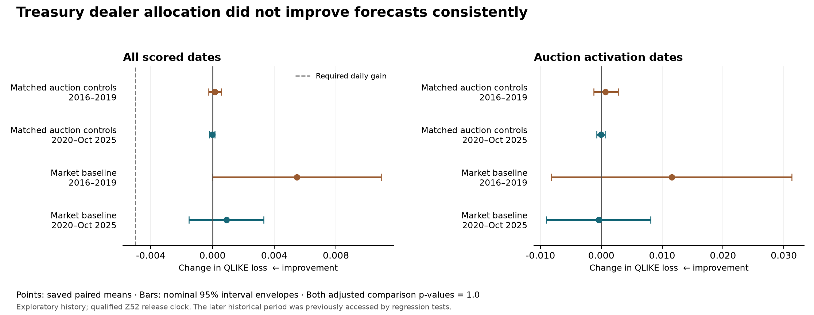

# Treasury dealer allocation and five-session QQQ volatility

**No new qualifying predictive signal.** The fixed experiment completed, passed sample support, and was independently reconstructed. Both comparisons failed the required improvement and stability gates.

The candidate adds the newly available dealer-allocation surprise to the existing market predictors, delayed Treasury ETF context and matched auction controls. The matched comparison isolates the surprise's additional value; the market comparison evaluates the whole added block. Negative QLIKE differences mean lower forecast loss.

| Control | Period | Daily dates | Daily loss difference | 95% interval envelope | Auction dates | Auction-date difference |
| --- | --- | ---: | ---: | --- | ---: | ---: |
| Matched auction controls | 2016–2019 | 931 | +0.000147 | [-0.000243, +0.000583] | 201 | +0.000659 |
| Matched auction controls | 2020–Oct 2025 | 1,384 | -0.000019 | [-0.000199, +0.000157] | 323 | -0.000054 |
| Market baseline | 2016–2019 | 931 | +0.005465 | [+0.000004, +0.010925] | 201 | +0.011561 |
| Market baseline | 2020–Oct 2025 | 1,384 | +0.000899 | [-0.001526, +0.003327] | 323 | -0.000398 |

The required daily improvement was at least 0.005 in **both** periods against **both** controls, with negative auction-date means, consistent fixed slices and offsets, and both multiple-testing corrections. Both whole-comparison adjusted p-values are 1.0. These probabilities apply to the complete comparisons, not individual table cells.

Against matched auction controls, development deteriorated slightly and the evaluation change was nearly zero. The matched evaluation difference also turned positive in 2023–2025, both daily and on auction dates. Against the original market baseline, daily loss increased in both main periods. Several calendar offsets failed the consistency requirement. There is no basis to promote or tune this inspected specification.

Independent verification covered 2,315 scored origins (524 auction-activation dates), 6,945 scored forecasts and 6,975 total issued forecasts. It reconstructed 118 monthly refits and 354 individual model fits, all 1,138 source-event feature audits, every sample-support floor, eight phase/endpoint comparisons and 24 block-inference calculations. The complete calendar has 6,696 positions. All 3,252 selected repository tests passed before the freeze; six historical replay tests were explicitly quarantined.

The two new comparisons preserve all 144 inherited entries, giving **146 registered comparisons**. Earlier unevaluable attempts remain in that family. This result is a completed nonqualifying test, not an insufficient-data result and not proof that every Treasury-related feature is useless or exactly equivalent.

## Source and validation qualifications

The ledger contains 1,135 known events, two events with unknown quantities, and one documented test auction excluded. January 27, 2020 Z52 uses only a qualified release-date assumption from cached Treasury-attributed text; the original PDF and historical delivery timestamp remain unavailable, and no quantities from that text are admitted. Rejecting the assumption leaves the previously documented unbounded strict-clock uncertainty. The saved result is conditional on this disclosed timing treatment.

All numerical Treasury forecasting inputs stop at October 20, 2025. **The later historical period cannot be called untouched:** six old regression tests accessed or refitted it during earlier full-suite runs. That claim has been corrected in the [historical-access disclosure](../predictive_prefit/HISTORICAL_TEST_ACCESS_CORRECTION.md). Those tests were excluded by exact ID for this run, with original files preserved. Prior aggregate results also already exposed the later period. Current bounded decoding does not undo that access.

Historical development and evaluation windows have been reused. Current archives do not certify every historical revision or intraday public release. The inherited vendor price field/vintage and implied-volatility history limitations remain. The fixed synthetic interval calibration passed its 90% diagnostic criterion but does not guarantee nominal market coverage or adjusted-tail calibration. This study establishes no causal auction effect, trading profit or untouched-future confirmation.

## Next experiment

Retain this result and return to the already designed model-state blend on admitted market data. That proposal combines the established baseline with a gradually adapting model and compares it with both individual models and a fitted constant blend. Its pure core is tested, but its historical issuance pipeline and prospective registration remain to be completed. The family and wave numbers must begin from the now-recorded 146 comparisons. A new source-engineering sweep is not required for that modeling question.

Evidence: [metrics](metrics.json), [independent reconstruction](verification.json), [sample support](support.json), [freeze](freeze_record.json), [selected-test results](TEST_GATE_RESULT.json), [exact test selection](TEST_SELECTION.json), [terminal record](terminal.json), and [PDF figure](comparison_intervals_v2.pdf).
